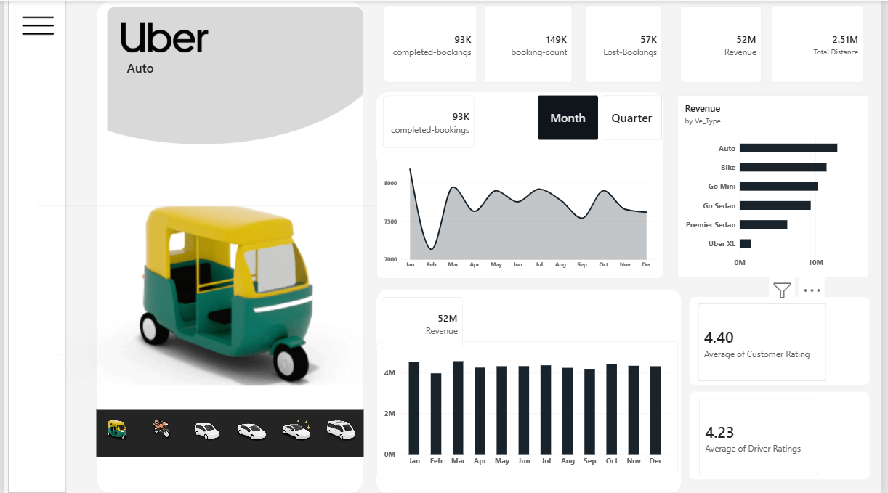
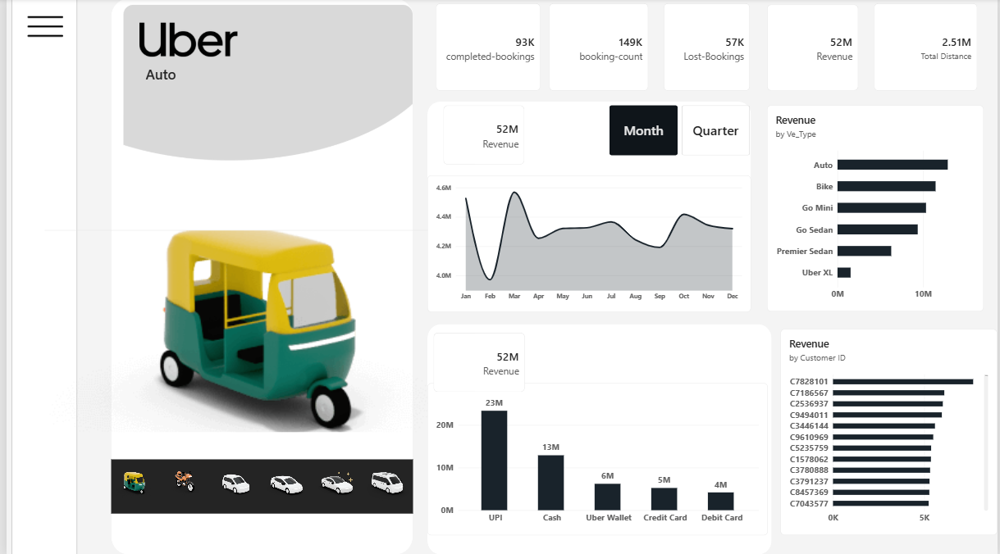
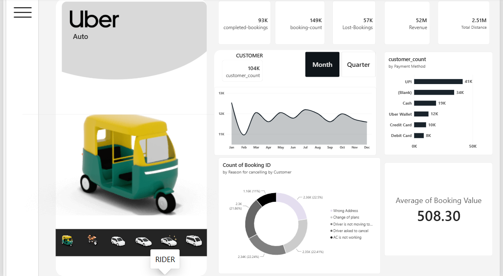

# 🚗 Uber Ride Bookings — Power BI Dashboard


## 📌 Overview

An interactive **4-page Power BI Dashboard** built on **150,000+ Uber ride booking records**, analyzing booking trends, revenue performance, cancellation patterns, and rider behavior across multiple vehicle types and payment methods.

---

## 🖥️ Dashboard Pages

### 1. Home
> Clean intro page with Uber branding, project description, and page navigation.



### 2. Overview
> High-level KPIs, monthly/quarterly trends, revenue by vehicle type, and ratings.



### 3. Revenue
> Revenue breakdown by payment method, vehicle type, top customers, and monthly trend.



### 4. Rider
> Customer count trends, cancellation reasons, payment method distribution, and average booking value.

---

## 📊 Key KPIs

| Metric | Value |
|---|---|
| ✅ Completed Bookings | 93K |
| ❌ Lost Bookings | 57K (38%) |
| 💰 Total Revenue | ₹52M |
| 📍 Total Distance | 2.51M km |
| ⭐ Avg Customer Rating | 4.40 |
| ⭐ Avg Driver Rating | 4.23 |
| 💵 Avg Booking Value | ₹508.30 |

---

## 🔍 Key Insights

- **38% of all bookings are lost** — primarily due to driver-side cancellations (27K), suggesting a need for better driver availability and incentive strategies.
- **Auto is the top revenue-generating vehicle** (~₹12.9M, 25% contribution), followed by Bike and Go Mini.
- **UPI dominates payments** (41K bookings, ~46%) — confirming strong digital payment adoption among Uber users.
- **Top cancellation reasons (customer-side):** Wrong Address (22.5%), Change of Plans (22.4%), Driver not moving toward pickup (22.4%) — address confirmation and driver tracking alerts could reduce these.
- **Monthly revenue is stable** (₹4.0M–₹4.6M range) with no major seasonal spikes.
- **Uber XL has the lowest demand** (~3% revenue) — potential for resource reallocation.
- **Top pickup/drop zones:** Khandsa, Saket, Barakhamba Road, Pragati Maidan — high-demand areas for driver allocation optimization.

---

## 🛠️ Tools & Technologies

| Tool | Purpose |
|---|---|
| **Power BI Desktop** | Dashboard design & visualization |
| **Excel (.xlsx)** | Data source (150K+ rows) |
| **Power Query** | Data type fixes & transformation |
| **DAX** | Custom measures & KPI calculations |

---

## 📐 DAX Measures

```dax
-- Completed Bookings
Completed Bookings = 
CALCULATE(COUNTROWS(Sheet1), Sheet1[Booking Status] = "Completed")

-- Lost Bookings
Lost Bookings = 
CALCULATE(COUNTROWS(Sheet1), Sheet1[Booking Status] <> "Completed")

-- Revenue
Revenue = SUM(Sheet1[Booking Value])

-- Total & Avg Distance
Total Distance = SUM(Sheet1[Ride Distance])
Avg Distance = AVERAGE(Sheet1[Ride Distance])

-- Ratings
Avg Rider Rating = AVERAGE(Sheet1[Customer Rating])
Avg Driver Rating = AVERAGE(Sheet1[Driver Ratings])

-- Contribution % by Vehicle
Cont% = 
VAR vehicle_remove_filter = CALCULATE([Revenue], ALL(Sheet1[Vehicle Type]))
VAR revenue = [Revenue]
RETURN DIVIDE(revenue, vehicle_remove_filter)
```

---

## 📁 Project Structure

```
uber-powerbi-dashboard/
│
├── UBER.pbix                  # Power BI dashboard file
├── uber.xlsx                  # Source data (150K+ rows)
├── introduction_page.png      # Home page screenshot
├── overview.png               # Overview page screenshot
├── Revenue.png                # Revenue page screenshot
├── Rider.png                  # Rider page screenshot
└── README.md                  # Project documentation
```

---

## 🔧 How to Use

1. Download `UBER.pbix` and `uber.xlsx`
2. Open `UBER.pbix` in **Power BI Desktop** (free from Microsoft)
3. If prompted, re-link data source to `uber.xlsx` via `Transform Data → Data Source Settings`
4. Use the **vehicle slicer** (bottom-left icons) to filter by vehicle type
5. Use **Month/Quarter toggle** buttons to switch chart views

---

## 📈 Skills Demonstrated

- ✅ Data cleaning & type conversion in Power Query
- ✅ Advanced DAX measures (CALCULATE, ALL, DIVIDE, VAR)
- ✅ Multi-page interactive dashboard design
- ✅ Custom visual elements (image slicers, vehicle icons)
- ✅ Business KPI analysis (revenue, bookings, cancellations, ratings)
- ✅ Insight extraction from 150,000+ row dataset

---

## 👤 Author

**Yash Vardhan**  
MCA Student | Chaudhary Charan Singh University  
Aspiring Data Analyst

---

## 📬 Connect

[](https://linkedin.com)
[](https://github.com/Yashvardhan9-alt)

---

⭐ **If you found this helpful, please star this repository!**
